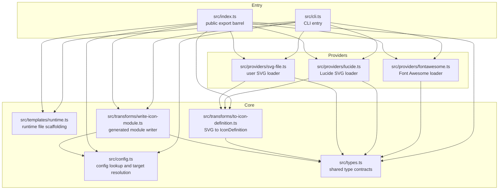

<!-- {{data("base.docs.langSwitcher", {labels: "relative"})}} -->
[日本語](ja/internal_design.md) | **English**
<!-- {{/data}} -->

# Internal Design

## Description

<!-- {{text({prompt: "Write a 1-2 sentence overview of this chapter. Include the project structure, module dependency direction, and key processing flows."})}} -->

The codebase is organized around a small TypeScript `src/` tree with a CLI entry point, configuration helpers, provider loaders, runtime file templates, transformation utilities, and shared type definitions, plus `dist/` for compiled output and `tests/` for unit and consumer-package verification. Dependencies flow inward from `src/cli.ts` and `src/index.ts` to config, providers, templates, and transforms, with providers and transforms sharing the `GeneratedIcon` and `IconDefinition` contracts; the main processing flow is command parsing, icon loading, target resolution, runtime scaffolding, and generated module writing.
<!-- {{/text}} -->

## Content

### Project Structure

<!-- {{text({prompt: "Describe the project's directory structure as a tree-format code block. Include role comments for key directories and files. Generate from the actual source code structure.", mode: "deep"})}} -->

```text
.
├── package.json                         # package manifest, npm scripts, binary entry, and public exports
├── README.md                            # user-facing usage and configuration guide
├── LICENSE                              # package license file
├── NOTICE                               # package notice file
├── tsconfig.base.json                   # shared TypeScript compiler settings
├── tsconfig.build.json                  # build-specific TypeScript configuration
├── pnpm-lock.yaml                       # dependency lockfile
├── src/                                 # TypeScript source for the generator
│   ├── cli.ts                           # CLI entry point; parses the add command and orchestrates generation
│   ├── config.ts                        # finds icons.json and resolves a logical target to a real directory
│   ├── index.ts                         # library export surface for internal modules and shared types
│   ├── types.ts                         # shared type definitions for SVG nodes and generated icons
│   ├── providers/                       # icon source loaders
│   │   ├── fontawesome.ts               # loads Font Awesome packages and normalizes icon data
│   │   ├── lucide.ts                    # reads Lucide SVG files and converts them to icon definitions
│   │   └── svg-file.ts                  # reads a user-supplied SVG file and converts it to icon definitions
│   ├── templates/                       # generated runtime source templates for consumer projects
│   │   └── runtime.ts                   # creates Icon.tsx, icon-types.ts, index.ts, and Font Awesome compatibility files
│   └── transforms/                      # format conversion and output writers
│       ├── to-icon-definition.ts        # parses SVG markup into the common IconDefinition structure
│       └── write-icon-module.ts         # writes a generated TypeScript icon module into the target directory
├── dist/                                # compiled JavaScript and declaration files published with the package
│   ├── cli.js                           # built CLI executable
│   ├── index.js                         # built library entry point
│   ├── config.js                        # built configuration helpers
│   ├── providers/                       # built provider modules
│   ├── templates/                       # built runtime template module
│   └── transforms/                      # built transform modules
├── tests/                               # unit tests and end-to-end package verification
│   ├── config.test.ts                   # target resolution tests
│   ├── providers.test.ts                # provider loading tests
│   ├── runtime.test.ts                  # runtime file creation and preservation tests
│   ├── svg-to-icon-definition.test.ts   # SVG parsing tests
│   ├── test-consumer.mjs                # packs the package and verifies a consumer can generate and bundle icons
│   └── verify-public-package.mjs        # validates publish contents and manifest constraints
├── docs/                                # project documentation in Markdown
└── specs/                               # repository directory present for specification artifacts
```
<!-- {{/text}} -->

### Module Composition

<!-- {{text({prompt: "List the major modules in table format. Include module name, file path, and responsibility. Extract from import/require relationships and exports in each file.", mode: "deep"})}} -->

| Module | File path | Responsibility |
| --- | --- | --- |
| CLI entry | `src/cli.ts` | Parses CLI arguments, validates the `add` command, dispatches to a provider loader, resolves the target directory, ensures runtime files exist, writes the generated icon module, and reports success or failure. |
| Configuration helpers | `src/config.ts` | Finds `icons.json`, reads `icons.json` and `tsconfig.json`, maps a logical target alias to a concrete output directory, and enforces that generated output stays inside the consumer project root. |
| Public API barrel | `src/index.ts` | Re-exports the main helpers, provider loaders, transforms, runtime generator, and shared type aliases for programmatic use. |
| Font Awesome provider | `src/providers/fontawesome.ts` | Dynamically imports the selected Font Awesome package, converts kebab-case icon names to Font Awesome export names, extracts SVG path data, and returns a `GeneratedIcon` with attribution metadata. |
| Lucide provider | `src/providers/lucide.ts` | Resolves a Lucide SVG asset from `lucide-static`, reads the file, converts the SVG to the shared icon definition format, and attaches Lucide attribution. |
| SVG file provider | `src/providers/svg-file.ts` | Reads a user-supplied SVG file, converts it to the shared icon definition format, and marks the result as custom attribution. |
| Runtime template generator | `src/templates/runtime.ts` | Defines the consumer-owned runtime source files and creates them once with `wx` semantics so existing user edits are preserved. |
| SVG parser transform | `src/transforms/to-icon-definition.ts` | Parses supported SVG elements and attributes into the internal `IconDefinition` and `SvgNode` structure, validating tag support and required `viewBox` data. |
| Icon module writer | `src/transforms/write-icon-module.ts` | Serializes a `GeneratedIcon` into a TypeScript module, computes the relative import to `icon-types.js`, validates the output path, and writes the file to disk. |
| Shared types | `src/types.ts` | Defines the common contracts used across providers and transforms, including SVG node tags, icon definitions, attribution metadata, and generated icon payloads. |
<!-- {{/text}} -->

### Module Dependencies

<!-- {{text({prompt: "Generate a mermaid graph showing inter-module dependencies. Analyze import/require statements in the source code and show the layer structure and dependency direction. Output only the mermaid code block. For line breaks inside node labels, use <br/> inside [...]; do not place a literal backslash-n (two characters) outside a label.", mode: "deep"})}} -->


<!-- {{/text}} -->

### Key Processing Flows

<!-- {{text({prompt: "Describe the inter-module data and control flow when running a representative command in numbered steps. Include the flow from entry point to final output.", mode: "deep"})}} -->

1. A consumer runs `spreadworks-icons add --provider ... --target ...`; `src/cli.ts` reads `process.argv`, strips a leading `--` if present, requires the command name to be `add`, and parses the remaining `--key value` pairs.
2. `src/cli.ts` validates required arguments with `required()`, rejects `--output`, and chooses a provider branch inline: `loadFontAwesomeIcon()` for `fontawesome`, `loadLucideIcon()` for `lucide`, or `loadSvgFileIcon()` for `svg-file`.
3. The selected provider returns a `GeneratedIcon`. `src/providers/fontawesome.ts` dynamically imports the chosen Font Awesome package and extracts path data, while `src/providers/lucide.ts` and `src/providers/svg-file.ts` pass SVG text through `svgToIconDefinition()` in `src/transforms/to-icon-definition.ts`.
4. If `--config` is not supplied, `findIconsConfig()` in `src/config.ts` walks upward from the current working directory until it finds `icons.json`. `resolveTargetDirectory()` then reads `icons.json` and the consumer project's `tsconfig.json`, resolves the logical target alias, and verifies that the output directory remains inside the project root.
5. `ensureRuntimeFiles()` in `src/templates/runtime.ts` creates the runtime support files in the target directory, including `Icon.tsx`, `icon-types.ts`, `index.ts`, `fontawesome/FontAwesomeIcon.tsx`, and `fontawesome/fontawesome-svg-core/styles.css`. Existing files are preserved because each write uses the `wx` flag.
6. Back in `src/cli.ts`, the output subpath is derived from the provider: Font Awesome files go under `fontawesome/<source>/`, Lucide files under `lucide/`, and user SVG files under `custom/`. Font Awesome uses the provider-supplied symbol name as the filename; other providers use the requested icon name.
7. `writeIconModule()` in `src/transforms/write-icon-module.ts` validates that the final file stays inside the configured target directory, computes the relative import path to `icon-types.js`, serializes the icon nodes into TypeScript source, and writes the generated module.
8. On success, `src/cli.ts` prints `Generated <path>` to standard output. Any thrown error is caught by the top-level `main().catch(...)` handler, which writes the error message to standard error and sets exit code `1`.
<!-- {{/text}} -->

### Extension Points

<!-- {{text({prompt: "Describe the locations that need changes and extension patterns when adding new commands or features. Derive from plugin points and dispatch registration patterns in the source code.", mode: "deep"})}} -->

The current extension points are code-level registrations rather than a plugin system. `src/cli.ts` hard-codes both command dispatch and provider dispatch, so adding a new command starts by extending the `main()` command check beyond `add`, defining its argument requirements there, and wiring it to new implementation code.

Adding a new icon source follows the existing provider pattern: create a new module under `src/providers/` that returns `Promise<GeneratedIcon>`, reuse `svgToIconDefinition()` from `src/transforms/to-icon-definition.ts` if the source can be expressed as SVG text, and then register the new provider branch in `src/cli.ts`. If the provider needs a different output layout or filename rule, the `directory` and `filename` selection logic in `src/cli.ts` must also be updated.

Features that change how consumer runtime files are scaffolded belong in `src/templates/runtime.ts`, where the `files` map defines every generated support file. Features that change the emitted icon module format belong in `src/transforms/write-icon-module.ts`, and any shared contract changes must be reflected in `src/types.ts` and in the runtime templates that mirror those types into the consumer project.

`src/index.ts` is the place to expose new reusable helpers through the package's programmatic API. The existing test layout shows the expected verification pattern: add focused unit coverage under `tests/*.test.ts` for the changed module and extend `tests/test-consumer.mjs` when the feature affects end-to-end generation, packaging, or consumer bundling behavior.
<!-- {{/text}} -->

---

<!-- {{data("base.docs.nav")}} -->
[← Configuration and Customization](configuration.md) | [Development, Testing, and Distribution →](development_testing.md)
<!-- {{/data}} -->
