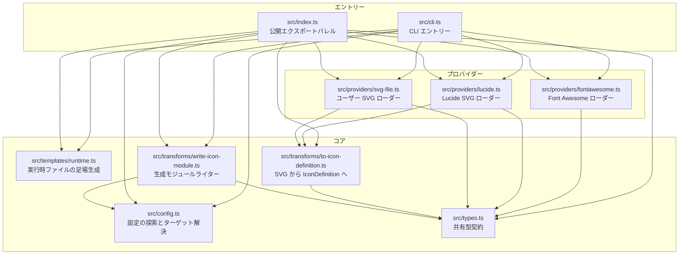

# 内部設計

## 説明

<!-- {{text({prompt: "Write a 1-2 sentence overview of this chapter. Include the project structure, module dependency direction, and key processing flows."})}} -->

このコードベースは、小規模な TypeScript の `src/` ツリーを中心に構成されており、CLI のエントリーポイント、設定ヘルパー、プロバイダーローダー、実行時ファイルテンプレート、変換ユーティリティ、共有型定義に加え、コンパイル済み出力用の `dist/` と、単体テストおよび利用側パッケージ検証用の `tests/` を備えています。依存関係は `src/cli.ts` と `src/index.ts` から設定、プロバイダー、テンプレート、変換へ向かって内側に流れ、プロバイダーと変換は `GeneratedIcon` と `IconDefinition` の契約を共有します。主な処理の流れは、コマンド解析、アイコン読み込み、対象解決、実行時基盤の生成、生成モジュールの書き込みです。
<!-- {{/text}} -->

## 内容

### プロジェクト構成

<!-- {{text({prompt: "Describe the project's directory structure as a tree-format code block. Include role comments for key directories and files. Generate from the actual source code structure.", mode: "deep"})}} -->

```text
.
├── package.json                         # package manifest, npm scripts, binary entry, and public exports
├── README.md                            # user-facing usage and configuration guide
├── LICENSE                              # package license file
├── NOTICE                               # package notice file
├── tsconfig.base.json                   # shared TypeScript compiler settings
├── tsconfig.build.json                  # build-specific TypeScript configuration
├── pnpm-lock.yaml                       # dependency lockfile
├── src/                                 # TypeScript source for the generator
│   ├── cli.ts                           # CLI entry point; parses the add command and orchestrates generation
│   ├── config.ts                        # finds icons.json and resolves a logical target to a real directory
│   ├── index.ts                         # library export surface for internal modules and shared types
│   ├── types.ts                         # shared type definitions for SVG nodes and generated icons
│   ├── providers/                       # icon source loaders
│   │   ├── fontawesome.ts               # loads Font Awesome packages and normalizes icon data
│   │   ├── lucide.ts                    # reads Lucide SVG files and converts them to icon definitions
│   │   └── svg-file.ts                  # reads a user-supplied SVG file and converts it to icon definitions
│   ├── templates/                       # generated runtime source templates for consumer projects
│   │   └── runtime.ts                   # creates Icon.tsx, icon-types.ts, index.ts, and Font Awesome compatibility files
│   └── transforms/                      # format conversion and output writers
│       ├── to-icon-definition.ts        # parses SVG markup into the common IconDefinition structure
│       └── write-icon-module.ts         # writes a generated TypeScript icon module into the target directory
├── dist/                                # compiled JavaScript and declaration files published with the package
│   ├── cli.js                           # built CLI executable
│   ├── index.js                         # built library entry point
│   ├── config.js                        # built configuration helpers
│   ├── providers/                       # built provider modules
│   ├── templates/                       # built runtime template module
│   └── transforms/                      # built transform modules
├── tests/                               # unit tests and end-to-end package verification
│   ├── config.test.ts                   # target resolution tests
│   ├── providers.test.ts                # provider loading tests
│   ├── runtime.test.ts                  # runtime file creation and preservation tests
│   ├── svg-to-icon-definition.test.ts   # SVG parsing tests
│   ├── test-consumer.mjs                # packs the package and verifies a consumer can generate and bundle icons
│   └── verify-public-package.mjs        # validates publish contents and manifest constraints
├── docs/                                # project documentation in Markdown
└── specs/                               # repository directory present for specification artifacts
```
<!-- {{/text}} -->

### モジュール構成

<!-- {{text({prompt: "List the major modules in table format. Include module name, file path, and responsibility. Extract from import/require relationships and exports in each file.", mode: "deep"})}} -->

| モジュール | ファイルパス | 責務 |
| --- | --- | --- |
| CLI エントリー | `src/cli.ts` | CLI 引数を解析し、`add` コマンドを検証し、プロバイダーローダーへ振り分け、対象ディレクトリを解決し、実行時ファイルの存在を保証し、生成されたアイコンモジュールを書き込み、成功または失敗を報告します。 |
| 設定ヘルパー | `src/config.ts` | `icons.json` を探索し、`icons.json` と `tsconfig.json` を読み取り、論理ターゲットエイリアスを実際の出力ディレクトリへ対応付け、生成出力が利用側プロジェクトのルート内に収まることを保証します。 |
| 公開 API バレル | `src/index.ts` | プログラムから利用できるように、主要なヘルパー、プロバイダーローダー、変換、実行時ジェネレーター、共有型エイリアスを再エクスポートします。 |
| Font Awesome プロバイダー | `src/providers/fontawesome.ts` | 選択された Font Awesome パッケージを動的にインポートし、kebab-case のアイコン名を Font Awesome のエクスポート名へ変換し、SVG パスデータを抽出して、帰属メタデータ付きの `GeneratedIcon` を返します。 |
| Lucide プロバイダー | `src/providers/lucide.ts` | `lucide-static` から Lucide の SVG アセットを解決し、ファイルを読み取り、SVG を共有アイコン定義形式に変換し、Lucide の帰属情報を付与します。 |
| SVG ファイルプロバイダー | `src/providers/svg-file.ts` | ユーザーが指定した SVG ファイルを読み取り、共有アイコン定義形式に変換し、結果をカスタム帰属として扱います。 |
| 実行時テンプレートジェネレーター | `src/templates/runtime.ts` | 利用側が所有する実行時ソースファイルを定義し、既存のユーザー編集を保持するために `wx` セマンティクスで一度だけ作成します。 |
| SVG パーサー変換 | `src/transforms/to-icon-definition.ts` | 対応する SVG 要素と属性を内部の `IconDefinition` および `SvgNode` 構造へ解析し、タグの対応状況と必須の `viewBox` データを検証します。 |
| アイコンモジュールライター | `src/transforms/write-icon-module.ts` | `GeneratedIcon` を TypeScript モジュールへシリアライズし、`icon-types.js` への相対インポートを計算し、出力パスを検証して、ファイルをディスクへ書き込みます。 |
| 共有型 | `src/types.ts` | SVG ノードタグ、アイコン定義、帰属メタデータ、生成アイコンのペイロードを含め、プロバイダーと変換全体で使われる共通契約を定義します。 |
<!-- {{/text}} -->

### モジュール依存関係

<!-- {{text({prompt: "Generate a mermaid graph showing inter-module dependencies. Analyze import/require statements in the source code and show the layer structure and dependency direction. Output only the mermaid code block. For line breaks inside node labels, use <br/> inside [...]; do not place a literal backslash-n (two characters) outside a label.", mode: "deep"})}} -->


<!-- {{/text}} -->

### 主要な処理フロー

<!-- {{text({prompt: "Describe the inter-module data and control flow when running a representative command in numbered steps. Include the flow from entry point to final output.", mode: "deep"})}} -->

1. 利用側が `spreadworks-icons add --provider ... --target ...` を実行すると、`src/cli.ts` は `process.argv` を読み取り、先頭に `--` があれば取り除き、コマンド名が `add` であることを必須とし、残りの `--key value` の組を解析します。
2. `src/cli.ts` は `required()` で必須引数を検証し、`--output` を拒否したうえで、プロバイダーごとにその場で分岐します。`fontawesome` なら `loadFontAwesomeIcon()`、`lucide` なら `loadLucideIcon()`、`svg-file` なら `loadSvgFileIcon()` を選びます。
3. 選択されたプロバイダーは `GeneratedIcon` を返します。`src/providers/fontawesome.ts` は選択された Font Awesome パッケージを動的にインポートしてパスデータを抽出し、`src/providers/lucide.ts` と `src/providers/svg-file.ts` は SVG テキストを `src/transforms/to-icon-definition.ts` の `svgToIconDefinition()` に渡します。
4. `--config` が指定されていない場合、`src/config.ts` の `findIconsConfig()` は現在の作業ディレクトリから上位へたどって `icons.json` を探します。続いて `resolveTargetDirectory()` が `icons.json` と利用側プロジェクトの `tsconfig.json` を読み取り、論理ターゲットエイリアスを解決し、出力ディレクトリがプロジェクトルート内に収まっていることを確認します。
5. `src/templates/runtime.ts` の `ensureRuntimeFiles()` は、`Icon.tsx`、`icon-types.ts`、`index.ts`、`fontawesome/FontAwesomeIcon.tsx`、`fontawesome/fontawesome-svg-core/styles.css` を含む実行時サポートファイルを対象ディレクトリ内に作成します。各書き込みは `wx` フラグを使うため、既存ファイルは保持されます。
6. `src/cli.ts` に戻ると、出力先のサブパスはプロバイダーに応じて決まります。Font Awesome のファイルは `fontawesome/<source>/` 配下、Lucide のファイルは `lucide/` 配下、ユーザー SVG ファイルは `custom/` 配下です。ファイル名は、Font Awesome ではプロバイダーが返したシンボル名を使い、それ以外のプロバイダーでは要求されたアイコン名を使います。
7. `src/transforms/write-icon-module.ts` の `writeIconModule()` は、最終的なファイルが設定済みの対象ディレクトリ内に収まることを検証し、`icon-types.js` への相対インポートパスを計算し、アイコンノードを TypeScript ソースへシリアライズして、生成モジュールを書き込みます。
8. 成功すると、`src/cli.ts` は標準出力に `Generated <path>` を出力します。送出されたエラーはすべて最上位の `main().catch(...)` ハンドラーで捕捉され、エラーメッセージが標準エラー出力に書き込まれ、終了コード `1` が設定されます。
<!-- {{/text}} -->

### 拡張ポイント

<!-- {{text({prompt: "Describe the locations that need changes and extension patterns when adding new commands or features. Derive from plugin points and dispatch registration patterns in the source code.", mode: "deep"})}} -->

現在の拡張ポイントは、プラグインシステムではなくコード上の登録箇所です。`src/cli.ts` にはコマンドの振り分けとプロバイダーの振り分けの両方がハードコードされているため、新しいコマンドを追加するには、まず `main()` のコマンド判定を `add` 以外にも広げ、そこで必要な引数を定義し、新しい実装コードへ接続する必要があります。

新しいアイコンソースを追加する場合は、既存のプロバイダーパターンに従います。`src/providers/` 配下に `Promise<GeneratedIcon>` を返す新しいモジュールを作成し、そのソースが SVG テキストとして表現できるなら `src/transforms/to-icon-definition.ts` の `svgToIconDefinition()` を再利用し、そのうえで `src/cli.ts` に新しいプロバイダー分岐を登録します。プロバイダーごとに異なる出力レイアウトやファイル名の規則が必要なら、`src/cli.ts` の `directory` と `filename` の選択ロジックも更新しなければなりません。

利用側の実行時ファイルの足場生成を変える機能は、生成されるサポートファイルを `files` マップで定義している `src/templates/runtime.ts` に置くべきです。出力されるアイコンモジュール形式を変える機能は `src/transforms/write-icon-module.ts` に属し、共有契約を変更する場合は `src/types.ts` と、それらの型を利用側プロジェクトへ反映する実行時テンプレートの両方に修正を反映する必要があります。

`src/index.ts` は、パッケージのプログラム向け API として新しい再利用可能ヘルパーを公開する場所です。現在のテスト構成は期待される検証パターンも示しています。変更したモジュールに対する焦点の合った単体テストを `tests/*.test.ts` に追加し、その機能がエンドツーエンドの生成、パッケージング、または利用側でのバンドル動作に影響する場合は `tests/test-consumer.mjs` も拡張します。
<!-- {{/text}} -->

---

<!-- {{data("base.docs.nav")}} -->
[← 設定とカスタマイズ](configuration.md) | [開発、テスト、配布 →](development_testing.md)
<!-- {{/data}} -->
