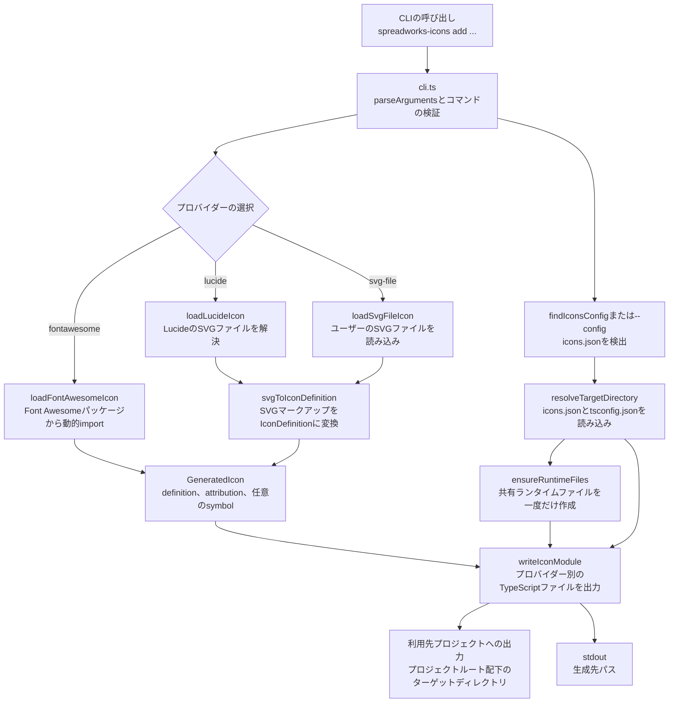
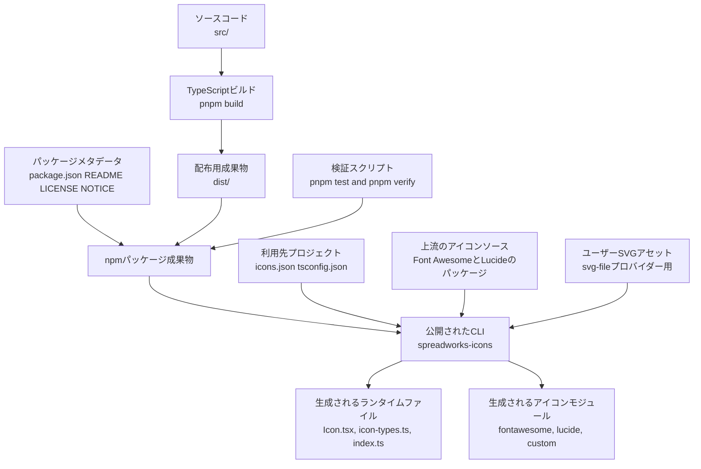

# ツール概要とアーキテクチャ

## 説明

<!-- {{text({prompt: "Write a 1-2 sentence overview of this chapter. Include the tool's purpose, the problem it solves, and its primary use cases."})}} -->

`@spreadworks/icons` は、利用先のプロジェクトに React SVG アイコンのソースファイルを直接生成する CLI です。これにより、アプリケーションはこのパッケージや上流のアイコンライブラリに実行時依存せずにアイコンを利用できます。主な用途は、Font Awesome 互換のモジュール生成、Lucide アイコンの取り込み、カスタム SVG ファイルをツリーシェイク可能な TypeScript アイコンモジュールへ変換することです。
<!-- {{/text}} -->

## 内容

### 目的

<!-- {{text({prompt: "Describe the problem this CLI tool solves and its target users. Derive the purpose from package.json and README."})}} -->

この CLI は、React プロジェクトで再利用可能なアイコンを提供しつつ、生成用パッケージやサードパーティ製アイコンパッケージをアプリケーションの実行時に残さずに済むようにするためのものです。アプリケーション自身が所有するアイコンソース、TypeScript と相性のよい import、既存の Font Awesome の import パターンとの互換性、さらにライブラリ由来のアイコンとカスタム SVG アセットの両方を扱いたい開発者向けに設計されています。
<!-- {{/text}} -->

### アーキテクチャ概要

<!-- {{text({prompt: "Generate a mermaid flowchart showing the tool's overall architecture. Include the dispatch structure from entry point to subcommands and the main processing flow (input → processing → output). Output only the mermaid code block. For line breaks inside node labels, use   inside [...]; do not place a literal backslash-n (two characters) outside a label.", mode: "deep"})}} -->

<!-- {{/text}} -->

### 主要な概念

<!-- {{text({prompt: "Explain the key concepts and terminology needed to understand this tool in table format. Extract the main concepts from source code."})}} -->

| 概念 | このプロジェクトでの意味 |
| --- | --- |
| 論理ターゲット | `--target` で渡す `icons` のような名前付きの出力先です。直接の出力パスではなく、`icons.json` と `tsconfig.json` を通じて解決されます。 |
| `icons.json` のエイリアス | `aliases` エントリーは、論理ターゲットを `@icons` のような TypeScript のパスエイリアス接頭辞に対応付けます。 |
| TypeScript のパスマッピング | `tsconfig.json` では `<alias>/*` を実際のディレクトリ `/*` 付きで対応付ける必要があり、CLI はそのマッピングを使って出力先ディレクトリを計算します。 |
| プロバイダー | `--provider` で選ぶアイコンの供給元です。`fontawesome`、`lucide`、`svg-file` があります。 |
| `GeneratedIcon` | プロバイダーが返す内部オブジェクトです。正規化されたアイコン定義、帰属表示テキスト、任意のプロバイダー互換 export symbol を持ちます。 |
| `IconDefinition` | 生成ファイルに書き出される共通の出力形式です。アイコン名、`viewBox`、正規化済みの SVG ノードを保持します。 |
| ランタイムファイル | `Icon.tsx`、`icon-types.ts`、`index.ts`、Font Awesome 互換ファイルなどの共有ファイルです。これらはターゲットディレクトリに一度だけ作成され、その後は保持されます。 |
| 帰属表示 | 生成されたアイコンモジュールにコメントヘッダーとして挿入されるライセンスまたは再配布に関する注記です。 |
| プロバイダー互換 symbol | 互換性のために保持される export 名です。たとえば Font Awesome アイコンの `faChevronRight` などがあります。 |
| 対応している SVG ノード | SVG パーサーは `path`、`circle`、`rect`、`line`、`polyline`、`polygon`、`g` を受け付けます。未対応の要素は拒否されます。 |
<!-- {{/text}} -->

### 一般的な利用の流れ

<!-- {{text({prompt: "Describe the typical steps from installation to first output in step format. Derive the steps from help output and command definitions in the source code."})}} -->

1. 開発依存関係としてパッケージをインストールします。たとえば `pnpm add -D @spreadworks/icons` を実行します。
2. 利用先プロジェクトに `icons.json` を作成し、`aliases` に `{ "icons": "@icons" }` のような論理ターゲットを定義します。
3. `tsconfig.json` に `@icons/*` 用の対応するパスマッピングを追加し、ターゲットが `./src/icons/*` のようなディレクトリに解決されるようにします。
4. 唯一サポートされているコマンド `spreadworks-icons add` を、プロバイダー、ターゲット、プロバイダー固有のオプション付きで実行します。たとえば `pnpm exec spreadworks-icons add --provider lucide --icon chevron-right --target icons` です。
5. CLI は現在のディレクトリから親方向へ `icons.json` を自動的に探索するか、`--config <path>` が渡されていればそれを使います。
6. 実行時には、要求されたアイコンを読み込み、ターゲットディレクトリを解決し、共有ランタイムファイルがまだ存在しなければ作成し、生成したアイコンモジュールをプロバイダー別のサブディレクトリに書き込みます。
7. 最初の実行に成功すると、`Icon.tsx`、`icon-types.ts`、`index.ts`、要求したアイコンモジュールなどのファイルが生成され、標準出力には `Generated <path>` と表示されます。
<!-- {{/text}} -->

# システム概要

<!-- {{data("monorepo.monorepo.apps", {labels: "overview", ignoreError: true})}} -->
<!-- {{/data}} -->

<!-- {{text({prompt: "Write a 1-2 sentence overview of this project."})}} -->

このプロジェクトは、実行時にアイコンを提供するのではなく、利用先のリポジトリへ React アイコンのソースファイルを生成する単一パッケージの TypeScript CLI です。プロバイダーアダプター、SVG の正規化、ランタイムテンプレートの生成、公開時の検証を組み合わせることで、配布パッケージを小さく保ちながら、生成されたコードの所有権は利用者側に持たせています。
<!-- {{/text}} -->

## 説明

<!-- {{text({prompt: "Write a 1-2 sentence overview of this chapter. Include the project's architecture and whether it integrates with external systems."})}} -->

このプロジェクトは、コマンドの振り分け、設定解決、プロバイダー読み込み、SVG 変換、ファイルテンプレート生成、出力書き込みを明確に分けた、コンパクトな TypeScript コードジェネレーターとして構成されています。外部システムとの連携は生成時とリリース時に限られ、利用先プロジェクトの設定やファイルを読み取り、上流のアイコンパッケージを読み込み、ビルド済み CLI を公開 npm レジストリへ公開します。
<!-- {{/text}} -->

## 内容
### アーキテクチャ図

<!-- {{text({prompt: "Generate a mermaid flowchart showing the project architecture. Include data flows between major components. Output only the mermaid code block. For line breaks inside node labels, use   inside [...]; do not place a literal backslash-n (two characters) outside a label."})}} -->

<!-- {{/text}} -->
### コンポーネントの責務

<!-- {{text({prompt: "Describe the major components with their location, responsibilities, and I/O in table format.", mode: "deep"})}} -->

| コンポーネント | 配置場所 | 責務 | 入力 | 出力 |
| --- | --- | --- | --- | --- |
| CLI エントリーポイント | `src/cli.ts` | コマンドライン引数を解析し、サポートされているコマンドを検証し、プロバイダーごとに振り分け、ターゲットを解決し、生成されたパスを表示します。 | `process.argv`、現在の作業ディレクトリ、任意の `--config` パス | プロバイダー呼び出し、ランタイム生成、アイコンモジュール書き込み、stdout/stderr メッセージ |
| 設定リゾルバー | `src/config.ts` | `icons.json` を見つけ、ターゲットのエイリアスを読み取り、`tsconfig.json` のパスマッピングを読み取り、出力先がプロジェクトルート内に収まることを保証します。 | `icons.json`、`tsconfig.json`、ターゲット名、探索開始ディレクトリ | 絶対パスのターゲットディレクトリ |
| プロバイダーアダプター | `src/providers/fontawesome.ts`, `src/providers/lucide.ts`, `src/providers/svg-file.ts` | Font Awesome パッケージ、Lucide の SVG ファイル、またはユーザーの SVG ファイルからアイコンデータを読み込み、共通の生成形式へ変換します。 | ソース、アイコン名、ファイルパスなどのプロバイダーオプション | 定義と帰属表示を含む `GeneratedIcon` オブジェクト |
| SVG 正規化 | `src/transforms/to-icon-definition.ts` | 対応している SVG マークアップを解析し、内部の `IconDefinition` 構造へ変換します。 | 生の SVG テキストとアイコン名 | 正規化されたアイコン定義 |
| ランタイムテンプレートライター | `src/templates/runtime.ts` | 利用先ターゲットに共有の React ランタイムファイルを作成し、既存の利用者所有ファイルは保持します。 | ターゲットディレクトリのパス | `Icon.tsx`、`icon-types.ts`、`index.ts`、Font Awesome 互換ファイル |
| アイコンモジュールライター | `src/transforms/write-icon-module.ts` | アイコンノードを整形し、相対 import を計算し、プロバイダー別の TypeScript モジュールを書き込み、出力パスの安全性を担保します。 | `GeneratedIcon`、ターゲットディレクトリ、相対出力パス | 生成されたアイコンソースファイルのパス |
| 共通型と公開 export | `src/types.ts`, `src/index.ts` | 共通のアイコンデータ構造を定義し、パッケージ API を再 export します。 | 内部モジュールの型と export | 型定義とパッケージ export |
| ビルドとリリースの定義 | `package.json`, `dist/` | CLI バイナリ、ESM export、パッケージ内容、スクリプト、公開先を定義します。 | ビルド出力、README、ライセンスファイル | 公開用 npm パッケージ成果物 |
| 検証スイート | `tests/*.ts`, `tests/*.mjs` | 設定解決、SVG 解析、ランタイムファイルの保持、公開パッケージ内容、利用先での end-to-end 利用を検証します。 | ソースモジュール、パックされたパッケージ、一時的な利用先プロジェクト | テストの合否結果とリリース可否の判定 |
<!-- {{/text}} -->
### 外部連携

<!-- {{text({prompt: "If there are external system integrations, describe their purpose and connection method in table format."})}} -->

| 連携先 | 目的 | 接続方法 |
| --- | --- | --- |
| 利用先プロジェクトの設定 | 生成ファイルの書き込み先を決定します。 | ファイルシステムアクセスで利用先プロジェクトの `icons.json` と `tsconfig.json` を読み取ります。 |
| 利用先プロジェクトのファイルシステム | アプリケーションリポジトリが所有する生成済みランタイムファイルとアイコンモジュールを保存します。 | 解決したターゲットディレクトリ配下にディレクトリを作成し、ファイルを書き込みます。 |
| Font Awesome Free パッケージ | `free-solid` と `free-brands` の生成用にアイコンデータを供給します。 | インストール済みの `@fortawesome/*` パッケージに対して動的 `import()` を使います。 |
| 利用先でインストールされた Font Awesome Pro パッケージ | Pro パッケージをこのパッケージの依存関係として宣言せずに `pro-*` 生成用のアイコンデータを供給します。 | `@fortawesome/pro-light-svg-icons` のようなパッケージ名に対して動的 `import()` を行い、生成時に利用先プロジェクトから解決します。 |
| Lucide アイコンパッケージ | Lucide アイコン用の SVG ソースファイルを供給します。 | `createRequire(...).resolve()` を使って `lucide-static/icons/<name>.svg` を見つけ、その後ディスクからファイルを読み取ります。 |
| ユーザーの SVG アセット | 同梱されたアイコンライブラリ以外のカスタムアイコンを利用できるようにします。 | `--file` で渡されたファイルパスを読み取り、SVG 内容を解析します。 |
| npm レジストリ | CLI を公開パッケージとして配布します。 | `package.json` で `publishConfig.registry` を `https://registry.npmjs.org/` に設定し、リリーススクリプトで `pnpm publish --dry-run --access public` を実行して確認します。 |
<!-- {{/text}} -->
### 環境ごとの差異

<!-- {{text({prompt: "Describe the configuration differences across environments (local/staging/production)."})}} -->

| 環境 | 設定の違い |
| --- | --- |
| ローカル開発 | リポジトリのソースツリー、ローカルのビルド・テストスクリプト（`build`、`test`、`verify`、`release:check`）、および `pnpm` でインストールしたローカル依存関係を使います。CLI の挙動は利用先プロジェクトの `icons.json` と `tsconfig.json` によって決まり、ソース内では環境変数を参照していません。 |
| ステージング | ソースコードやパッケージマニフェストには、ステージング専用の設定ファイル、スクリプト、エンドポイント、条件分岐は定義されていません。実際には、ステージングでも他の環境と同じ CLI の挙動と利用先プロジェクト設定を使うことになります。 |
| 本番 | 公開済みの `@spreadworks/icons` パッケージを使い、`dist/cli.js` から `spreadworks-icons` バイナリを、`dist/` から ESM export を提供します。リリース時にパッケージ化されるのは `dist`、`README.md`、`LICENSE`、`NOTICE` のみで、公開前には `prepublishOnly` により完全な `pnpm verify` の通過が必須です。 |
| 共通の挙動 | すべての環境で、出力先は `--output` フラグではなく利用者側の論理ターゲットマッピングで制御され、生成ファイルは必ず利用先プロジェクトのルートディレクトリ内に収まらなければなりません。 |
<!-- {{/text}} -->

---

<!-- {{data("base.docs.nav")}} -->
[技術スタックと運用 →](stack_and_ops.md)
<!-- {{/data}} -->
