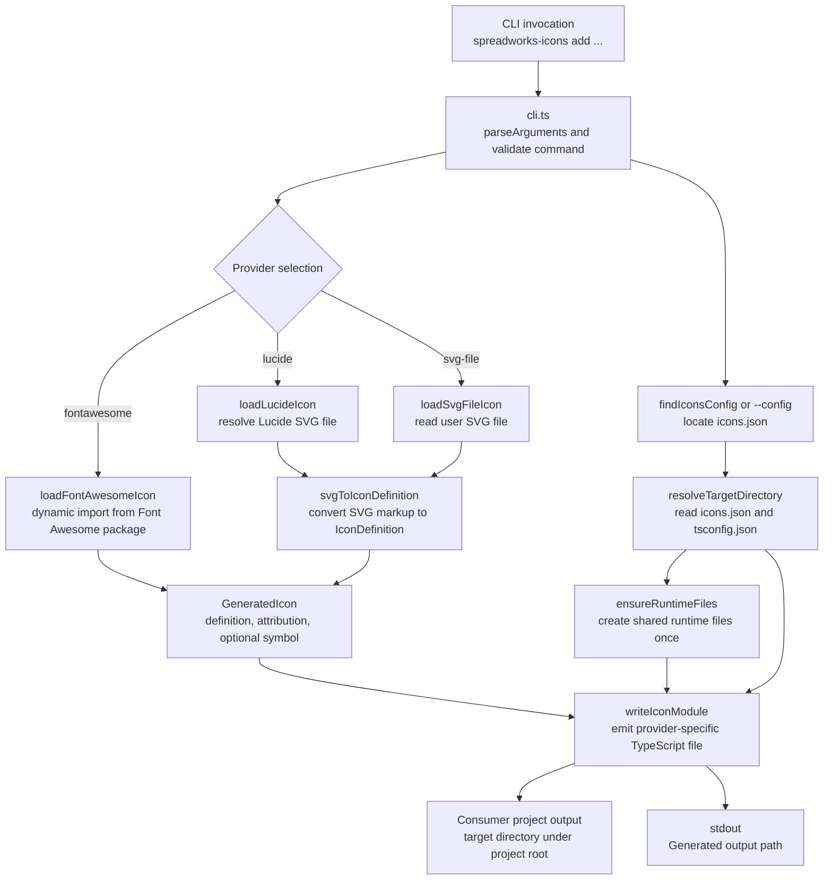
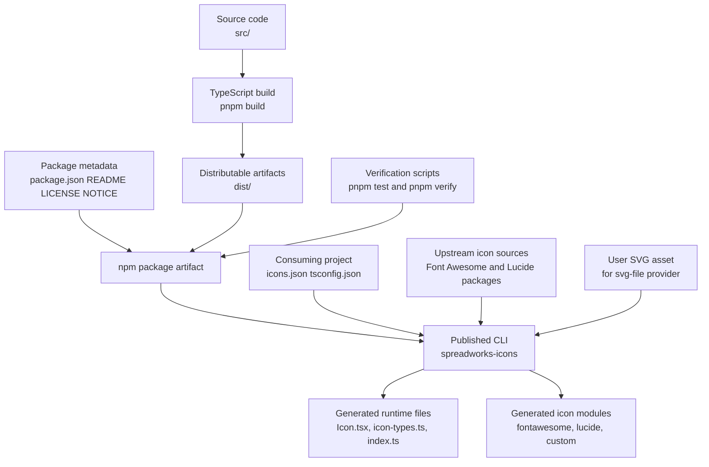

<!-- {{data("base.docs.langSwitcher", {labels: "relative"})}} -->
[日本語](ja/overview.md) | **English**
<!-- {{/data}} -->

# Tool Overview and Architecture

## Description

<!-- {{text({prompt: "Write a 1-2 sentence overview of this chapter. Include the tool's purpose, the problem it solves, and its primary use cases."})}} -->

`@spreadworks/icons` is a CLI that generates owned React SVG icon source files directly into a consuming project, so applications can use icons without a runtime dependency on this package or on upstream icon libraries. Its primary use cases are generating Font Awesome-compatible modules, importing Lucide icons, and converting custom SVG files into tree-shakeable TypeScript icon modules.
<!-- {{/text}} -->

## Content

### Purpose

<!-- {{text({prompt: "Describe the problem this CLI tool solves and its target users. Derive the purpose from package.json and README."})}} -->

This CLI solves the problem of shipping reusable icons in React projects without keeping a generator package or third-party icon package in the application runtime. It is designed for developers who want application-owned icon source, TypeScript-friendly imports, compatibility with existing Font Awesome import patterns, and support for both library-based icons and custom SVG assets.
<!-- {{/text}} -->

### Architecture Overview

<!-- {{text({prompt: "Generate a mermaid flowchart showing the tool's overall architecture. Include the dispatch structure from entry point to subcommands and the main processing flow (input → processing → output). Output only the mermaid code block. For line breaks inside node labels, use   inside [...]; do not place a literal backslash-n (two characters) outside a label.", mode: "deep"})}} -->

<!-- {{/text}} -->

### Key Concepts

<!-- {{text({prompt: "Explain the key concepts and terminology needed to understand this tool in table format. Extract the main concepts from source code."})}} -->

| Concept | Meaning in this project |
| --- | --- |
| Logical target | A named destination such as `icons` passed with `--target`; it is resolved through `icons.json` and `tsconfig.json` instead of a direct output path. |
| `icons.json` alias | The `aliases` entry maps a logical target to a TypeScript path alias prefix such as `@icons`. |
| TypeScript path mapping | `tsconfig.json` must map `<alias>/*` to a real directory ending in `/*`; the CLI uses that mapping to compute the output directory. |
| Provider | The icon source selected by `--provider`: `fontawesome`, `lucide`, or `svg-file`. |
| `GeneratedIcon` | The internal object returned by providers; it contains a normalized icon definition, attribution text, and an optional provider-compatible export symbol. |
| `IconDefinition` | The common output format written into generated files; it stores the icon name, `viewBox`, and normalized SVG nodes. |
| Runtime files | Shared files such as `Icon.tsx`, `icon-types.ts`, `index.ts`, and Font Awesome compatibility files that are created once in the target directory and preserved afterward. |
| Attribution | License or redistribution notes inserted as a comment header in generated icon modules. |
| Provider-compatible symbol | An export name preserved for compatibility, such as `faChevronRight` for Font Awesome icons. |
| Supported SVG nodes | The SVG parser accepts `path`, `circle`, `rect`, `line`, `polyline`, `polygon`, and `g`; unsupported elements are rejected. |
<!-- {{/text}} -->

### Typical Usage Flow

<!-- {{text({prompt: "Describe the typical steps from installation to first output in step format. Derive the steps from help output and command definitions in the source code."})}} -->

1. Install the package as a development dependency, for example `pnpm add -D @spreadworks/icons`.
2. Create `icons.json` in the consuming project and define a logical target in `aliases`, such as `{ "icons": "@icons" }`.
3. Add the matching `tsconfig.json` path mapping for `@icons/*` so the target resolves to a directory such as `./src/icons/*`.
4. Run the only supported command, `spreadworks-icons add`, with a provider, target, and provider-specific options, for example `pnpm exec spreadworks-icons add --provider lucide --icon chevron-right --target icons`.
5. The CLI locates `icons.json` automatically from the current directory upward, or uses `--config <path>` when provided.
6. During execution, it loads the requested icon, resolves the target directory, creates shared runtime files if they do not already exist, and writes the generated icon module into a provider-specific subdirectory.
7. The first successful run produces files such as `Icon.tsx`, `icon-types.ts`, `index.ts`, and the requested icon module, then prints `Generated <path>` to standard output.
<!-- {{/text}} -->

# System Overview

<!-- {{data("monorepo.monorepo.apps", {labels: "overview", ignoreError: true})}} -->
<!-- {{/data}} -->

<!-- {{text({prompt: "Write a 1-2 sentence overview of this project."})}} -->

This project is a single-package TypeScript CLI that generates React icon source files into a consuming repository instead of supplying icons at runtime. It combines provider adapters, SVG normalization, runtime template generation, and publish-time verification so the distributed package remains small while the consumer owns the generated code.
<!-- {{/text}} -->

## Description

<!-- {{text({prompt: "Write a 1-2 sentence overview of this chapter. Include the project's architecture and whether it integrates with external systems."})}} -->

The project is organized as a compact TypeScript code generator with clear layers for command dispatch, configuration resolution, provider loading, SVG transformation, file templating, and output writing. It integrates with external systems only at generation and release time: it reads consuming-project configuration and files, loads upstream icon packages, and publishes the built CLI to the public npm registry.
<!-- {{/text}} -->

## Content
### Architecture Diagram

<!-- {{text({prompt: "Generate a mermaid flowchart showing the project architecture. Include data flows between major components. Output only the mermaid code block. For line breaks inside node labels, use   inside [...]; do not place a literal backslash-n (two characters) outside a label."})}} -->

<!-- {{/text}} -->
### Component Responsibilities

<!-- {{text({prompt: "Describe the major components with their location, responsibilities, and I/O in table format.", mode: "deep"})}} -->

| Component | Location | Responsibility | Inputs | Outputs |
| --- | --- | --- | --- | --- |
| CLI entry point | `src/cli.ts` | Parses command-line arguments, validates the supported command, dispatches by provider, resolves the target, and prints the generated path. | `process.argv`, current working directory, optional `--config` path | Provider calls, runtime generation, icon module write, stdout/stderr messages |
| Configuration resolver | `src/config.ts` | Finds `icons.json`, reads target aliases, reads `tsconfig.json` path mappings, and ensures the output stays inside the project root. | `icons.json`, `tsconfig.json`, target name, start directory | Absolute target directory path |
| Provider adapters | `src/providers/fontawesome.ts`, `src/providers/lucide.ts`, `src/providers/svg-file.ts` | Load icon data from Font Awesome packages, Lucide SVG files, or user SVG files and convert them into the shared generated format. | Provider options such as source, icon name, or file path | `GeneratedIcon` objects with definition and attribution |
| SVG normalization | `src/transforms/to-icon-definition.ts` | Parses supported SVG markup and converts it to the internal `IconDefinition` structure. | Raw SVG text and icon name | Normalized icon definition |
| Runtime template writer | `src/templates/runtime.ts` | Creates the shared React runtime files in the consumer target and preserves existing user-owned files. | Target directory path | `Icon.tsx`, `icon-types.ts`, `index.ts`, Font Awesome compatibility files |
| Icon module writer | `src/transforms/write-icon-module.ts` | Formats icon nodes, computes relative imports, writes provider-specific TypeScript modules, and enforces output path safety. | `GeneratedIcon`, target directory, relative output path | Generated icon source file path |
| Shared types and public exports | `src/types.ts`, `src/index.ts` | Define the common icon data structures and re-export the package API. | Internal module types and exports | Type definitions and package exports |
| Build and release definition | `package.json`, `dist/` | Defines the CLI binary, ESM exports, package contents, scripts, and publish target. | Build outputs, README, license files | Public npm package artifact |
| Verification suite | `tests/*.ts`, `tests/*.mjs` | Verifies configuration resolution, SVG parsing, runtime-file preservation, published-package contents, and end-to-end consumer usage. | Source modules, packed package, temporary consumer project | Test pass/fail results and release gating |
<!-- {{/text}} -->
### External Integrations

<!-- {{text({prompt: "If there are external system integrations, describe their purpose and connection method in table format."})}} -->

| Integration | Purpose | Connection method |
| --- | --- | --- |
| Consuming project configuration | Determines where generated files should be written. | Reads `icons.json` and `tsconfig.json` from the consumer project with filesystem access. |
| Consuming project filesystem | Stores generated runtime files and icon modules owned by the application repository. | Creates directories and writes files under the resolved target directory. |
| Font Awesome Free packages | Supplies icon data for `free-solid` and `free-brands` generation. | Uses dynamic `import()` against installed `@fortawesome/*` packages. |
| Consumer-installed Font Awesome Pro packages | Supplies icon data for `pro-*` generation without declaring Pro packages as package dependencies. | Uses dynamic `import()` for package names such as `@fortawesome/pro-light-svg-icons`, resolved from the consuming project at generation time. |
| Lucide icon package | Supplies SVG source files for Lucide icons. | Uses `createRequire(...).resolve()` to locate `lucide-static/icons/<name>.svg`, then reads the file from disk. |
| User SVG assets | Allows custom icons outside bundled icon libraries. | Reads the file path passed with `--file` and parses the SVG content. |
| npm registry | Publishes the CLI as a public package. | `package.json` sets `publishConfig.registry` to `https://registry.npmjs.org/`, and release scripts run `pnpm publish --dry-run --access public` during checks. |
<!-- {{/text}} -->
### Environment Differences

<!-- {{text({prompt: "Describe the configuration differences across environments (local/staging/production)."})}} -->

| Environment | Configuration differences |
| --- | --- |
| Local development | Uses the repository source tree, local build/test scripts (`build`, `test`, `verify`, `release:check`), and local dependencies installed through `pnpm`. The CLI behavior is driven by the consuming project's `icons.json` and `tsconfig.json`; no environment variables are referenced in the source. |
| Staging | No staging-specific configuration files, scripts, endpoints, or conditional branches are defined in the source or package manifest. In practice, staging would use the same CLI behavior and consuming-project configuration as other environments. |
| Production | Uses the published `@spreadworks/icons` package, exposing the `spreadworks-icons` binary from `dist/cli.js` and ESM exports from `dist/`. Only `dist`, `README.md`, `LICENSE`, and `NOTICE` are packaged for release, and `prepublishOnly` requires a full `pnpm verify` pass before publication. |
| Common behavior | Across all environments, output location is controlled by the consumer's logical target mapping rather than an `--output` flag, and generated files must stay inside the consuming project's root directory. |
<!-- {{/text}} -->

---

<!-- {{data("base.docs.nav")}} -->
[Technology Stack and Operations →](stack_and_ops.md)
<!-- {{/data}} -->
